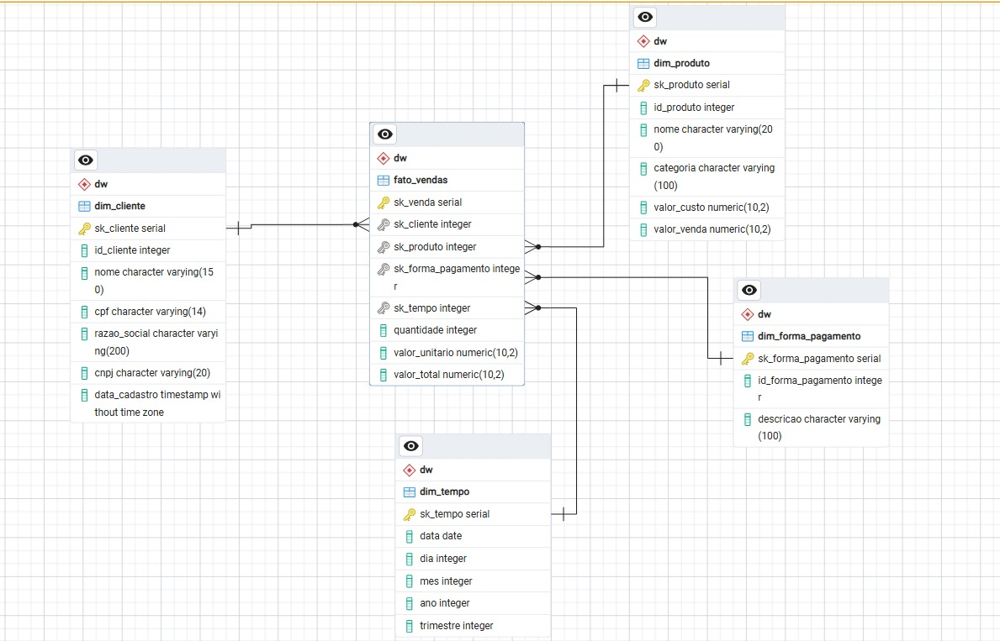
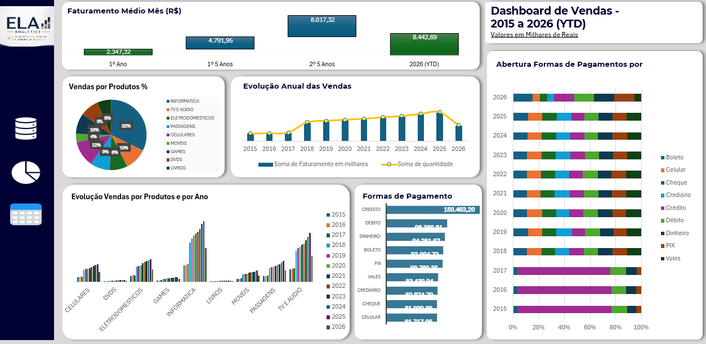

# 🗄️ Data Warehouse – ELA Analytics

Projeto final do **Módulo de ETL** do curso de Data Analytics – Digital College.

---

## 📌 Sobre o projeto

Construção de um **Data Warehouse completo** em modelo estrela utilizando PostgreSQL,
com schema DW separado da base operacional, processo de ETL e visualização dos resultados em Power BI.

---

## 🏗️ Arquitetura

O modelo segue a estrutura de **esquema estrela (star schema)**:

```
                    dim_produto
                        │
dim_cliente ──── fato_vendas ──── dim_forma_pagamento
                        │
                    dim_tempo
```
### Modelo Estrela

O Data Warehouse foi estruturado em modelo estrela, com a tabela `fato_vendas` centralizada e relacionada às dimensões de cliente, produto, forma de pagamento e tempo.



### Tabelas criadas

| Tabela | Tipo | Descrição |
|---|---|---|
| `fato_vendas` | Fato | Registros de vendas com chaves estrangeiras e métricas |
| `dim_cliente` | Dimensão | Nome, CPF, CNPJ e razão social |
| `dim_produto` | Dimensão | Nome, categoria, valor de custo e venda |
| `dim_forma_pagamento` | Dimensão | Descrição da forma de pagamento |
| `dim_tempo` | Dimensão | Data, dia, mês, ano e trimestre |

---

## 📊 Data Marts

Foram criados **3 Data Marts** para análise segmentada:

- **DM Vendas** – faturamento por período, categoria e produto
- **DM Clientes** – ranking e perfil de clientes por volume de compra
- **DM Produtos** – análise de desempenho por produto e forma de pagamento

---

## 🔍 Análises realizadas

- Faturamento total por mês e trimestre
- Produtos mais vendidos por categoria
- Análise por forma de pagamento
- Ranking de clientes por valor total de compras
- Dashboard final no **Power BI**

---

## 🛠️ Tecnologias utilizadas

- **PostgreSQL** – modelagem e criação do DW
- **SQL** – queries de ETL e análises
- **Power BI** – visualização dos resultados

---

## 📊 Dashboard de Vendas

O dashboard apresenta uma visão consolidada das vendas, permitindo acompanhar a evolução do faturamento, desempenho dos produtos e categorias e a distribuição das formas de pagamento ao longo dos períodos analisados.




### 🔎 Principais resultados

- **Informática** foi a categoria de maior participação nas vendas, com 32%.
- **Lavadora Ganca 10L** apresentou o maior faturamento entre os produtos analisados.
- **Crédito** foi a forma de pagamento com maior faturamento acumulado.
- **Mendes Bezerra Comércio de Móveis** liderou o ranking de clientes.

## 👩‍💻 Autoras

Projeto desenvolvido em grupo como trabalho final do Módulo de ETL:

- Amanda Mardelen Reinaldo Magalhães
- Eduarda
- Larisse


---


> Projeto acadêmico desenvolvido durante o curso de Data Analytics – Digital College, 2025.
